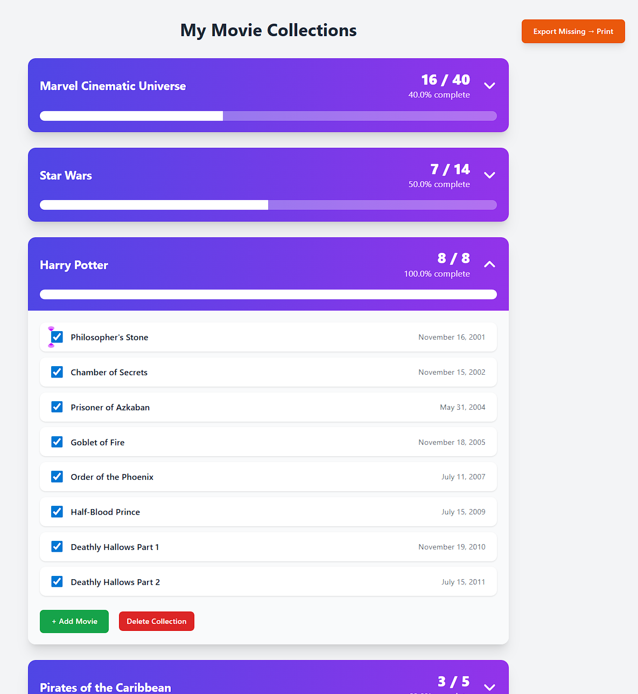

# Movie Collection Tracker



A simple Flask application I built to track my movie series collections. Each collection represents a movie franchise (for example: Pirates of the Caribbean, Middle-earth, the DCEU, DC Elseworlds, the Dark Knight Trilogy, etc.), and each collection contains the movies in that series. The app lets me track which movies I own and which ones I’m still missing.

Collections are fully customizable — you can name them anything and add any movies you want.

---

## Features

- Create and manage movie series collections  
- Add movies with optional release dates  
- Mark movies as collected or missing  
- View progress for each collection (owned vs total)  
- Export collection status to a file for external use (e.g., spreadsheets)  
- Clean, simple UI using HTML templates  
- SQLite database stored in Flask’s `instance/` folder 

---

## Tech Stack

| Component       | Purpose                          |
|-----------------|----------------------------------|
| Flask           | Web framework and routing        |
| SQLite          | Lightweight local database       |
| SQLAlchemy ORM  | Models and queries               |
| Jinja2          | HTML templating                  |
| HTML/CSS        | UI layout and styling            |

---

## Project Structure
```
.
├── app.py                # Main Flask app, routes, models, auto_seed helper
├── seed.py               # Manual seed script for loading full movie series
├── init_db.py            # (Optional) DB initialization script if used
├── instance/             # SQLite database (ignored in Git)
├── static/               # CSS or assets
├── templates/            # HTML templates
└── .gitignore
```


The `instance/` folder contains the SQLite database and is intentionally excluded from version control.

---

## Database Initialization

The app automatically creates tables on startup using:
```
with app.app_context():
db.create_all()
```


This only creates the schema — it does **not** insert any data.

---

## Seeding Collections (Manual)

The project includes a **manual seed script** (`seed.py`) that can preload entire movie series.  
This script uses the `auto_seed()` helper inside `app.py` to insert full collections at once.

Currently, `seed.py` seeds:

- Pirates of the Caribbean  
- Middle-earth (LOTR + Hobbit)  
- DC Extended Universe (DCEU)  
- DC Elseworlds  
- DC Universe (Gunn/Safran)  
- Dark Knight Trilogy  
- Avatar  

You can edit `seed.py` to seed any series you want.

To run the seed script:
```
python seed.py
```

The script only inserts a collection if it doesn’t already exist.

---
## Exporting Collection Status
The app includes an export feature that lets you save your collection status to a file so you can work with it in external tools (such as spreadsheets). This makes it easy to review which movies you own or are missing outside the app.

(Implementation details are kept simple and focused on my own workflow.)

---

## Running the App

1. Create a virtual environment  
2. Install dependencies:
```
pip install flask flask_sqlalchemy
```

3. (Optional) Seed collections:

```
python seed.py
```

4. Run the app:

```
flask run
```


The app will start on `http://127.0.0.1:5001/`.

---

## Future Improvements

- Add movie posters or image uploads  
- Add search or filtering  
- Add export/import functionality  
- Add optional authentication  

---

## License

MIT License


